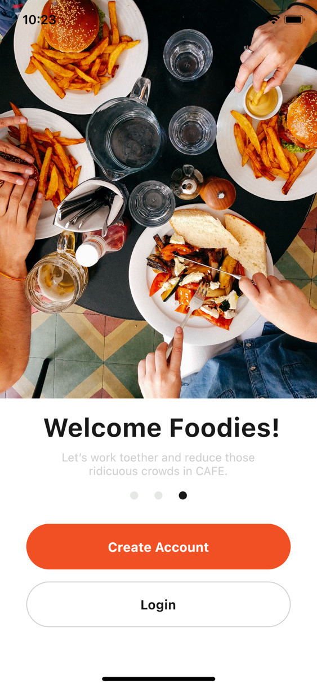
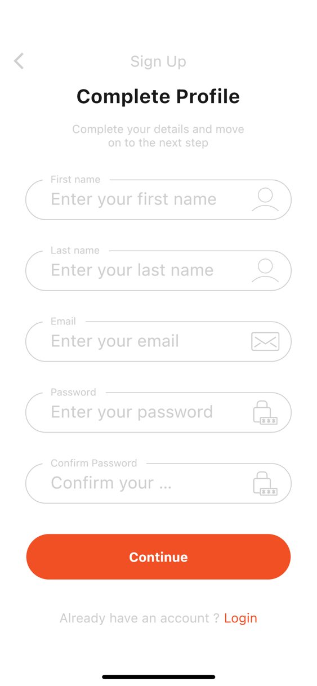

# Foodies

Concept app for Covenant University Students to help each other get meals using Flutter and Firebase for backend.
All data is retrieved from Firebase Firestore. Login and Signup is using Firebase email and password Authentication.

## Features

- Flutter UI
- Firebase Authentication
- Firebase Firestore
- Cross platform
- Clean Architecture Implementation

## List Of Screens
=> Onboarding Screen

=> Login Screen

=> Signup Screen

=> Complete Details Screen

=> Choose Option Screen

=> Home Screen (For Client and Partner)

=> Orders Screen (For Client and Partner)

=> Add Order Screen

=> Order Details Screen

=> Profile Screen (For Client and Partner)
## Screenshots

